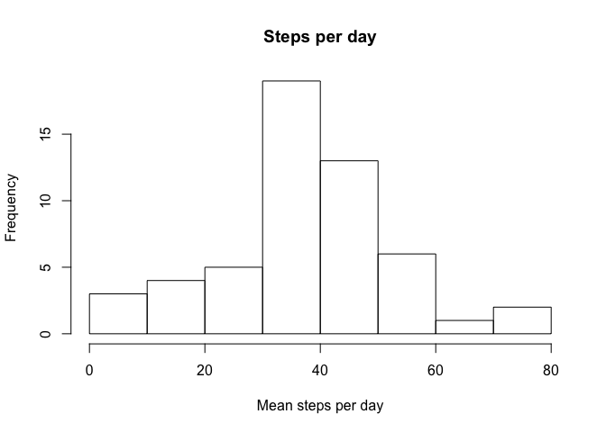
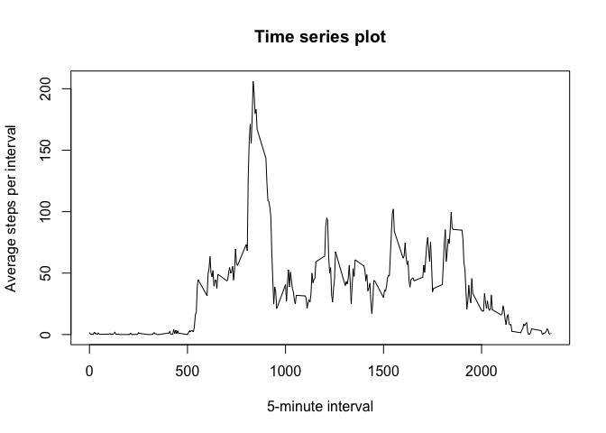
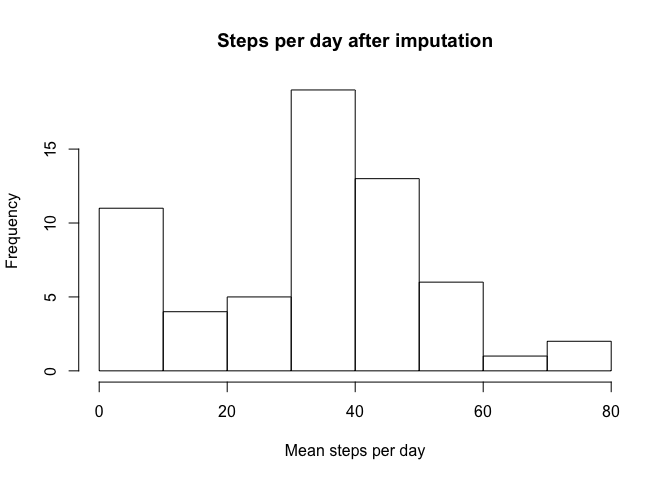
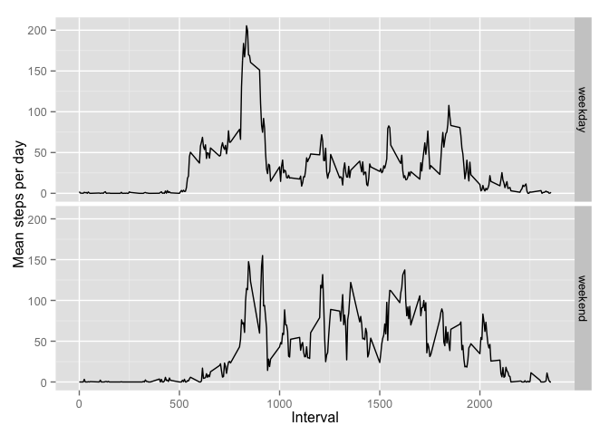

# Reproducible Research: Peer Assessment 1


## Loading and preprocessing the data

```r
data1 <- read.csv(file = "activity.csv", header = T, sep = ",")
```
## What is mean total number of steps taken per day?

```r
stepsDay <- by(data1$steps, data1$date, mean, na.rm = T)
hist(stepsDay, main = "Steps per day", xlab = "Mean steps per day")
```

 

```r
stepMean <- mean(stepsDay, na.rm = T)
stepMedian <- median(stepsDay, na.rm = T)
```
Mean total number of steps is 37.4.

Median total number of steps is 37.4.

## What is the average daily activity pattern?

```r
avgSteps <- by(data1$steps, data1$interval, mean, na.rm = T)
plot(unique(data1$interval), avgSteps, type = "l",
     ylab = "Average steps per interval", 
     xlab = "5-minute interval",
     main = "Time series plot")
```

 

```r
maxStep <- data1$interval[which.max(avgSteps)]
```
The interval 835 contains the maximum average number of steps.

## Imputing missing values

```r
totalNa <- sum(is.na(data1$steps) | is.na(data1$date) | is.na(data1$interval))
stepNa <- sum(is.na(data1$steps))
dateNa <- sum(is.na(data1$date))
intervalNa <- sum(is.na(data1$interval))
```
The total number of missing values is 2304; there are 2304, 0
and 0 missing values in steps, date and interval columns, accordingly.

I will be using the median step number for the time interval to fill in the missing 
values.


```r
data2 <- data1
naVec <- is.na(data2$steps)

medSteps <- by(data2$steps, data2$interval, median, na.rm = T)
names(medSteps) <- unique(data2$interval)

data2$steps[naVec] <- medSteps[as.character(data2$interval[naVec])]

stepsDay2 <- by(data2$steps, data2$date, mean)

hist(stepsDay2, main = "Steps per day after imputation", xlab = "Mean steps per day")
```

 

```r
stepMean2 <- mean(stepsDay2)
stepMedian2 <- median(stepsDay2)
```
Mean total number of steps after imputation is 33.

Median total number of steps after imputation is 36.1.

These values differ from the estimate without imputation, mean is lower by 
4.383055 steps, and median is lower by 1.2847222 steps.

## Are there differences in activity patterns between weekdays and weekends?

```r
Sys.setlocale("LC_TIME", "en_US") # for compatibility
```

```
## [1] "en_US"
```

```r
data2$dayType <- factor(ifelse(
    weekdays(
        as.Date(data2$date, "%Y-%m-%d"), abbreviate = T
    ) %in% c("Sat", "Sun"), "weekend", "weekday"
))

library(ggplot2)
library(data.table)
data2 <- as.data.table(data2)

ggplot(data2[,list(steps = mean(steps)), by=list(interval, dayType)]) +
    aes(interval, steps)+
    geom_line()+
    facet_grid(dayType ~ .)+
    xlab("Interval")+
    ylab("Mean steps per day")
```

 

So, the activity patterns are different.
